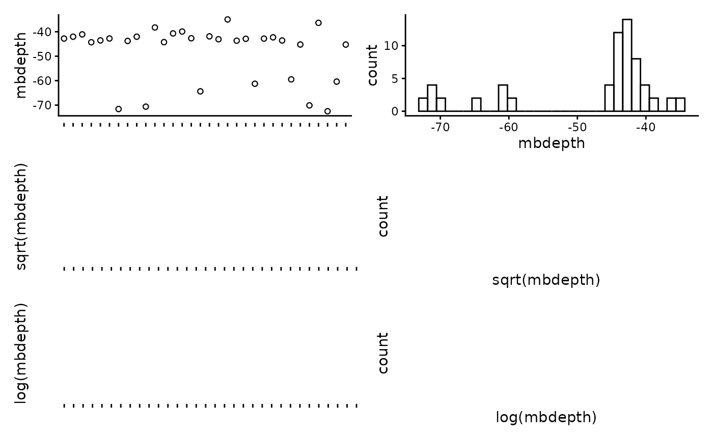
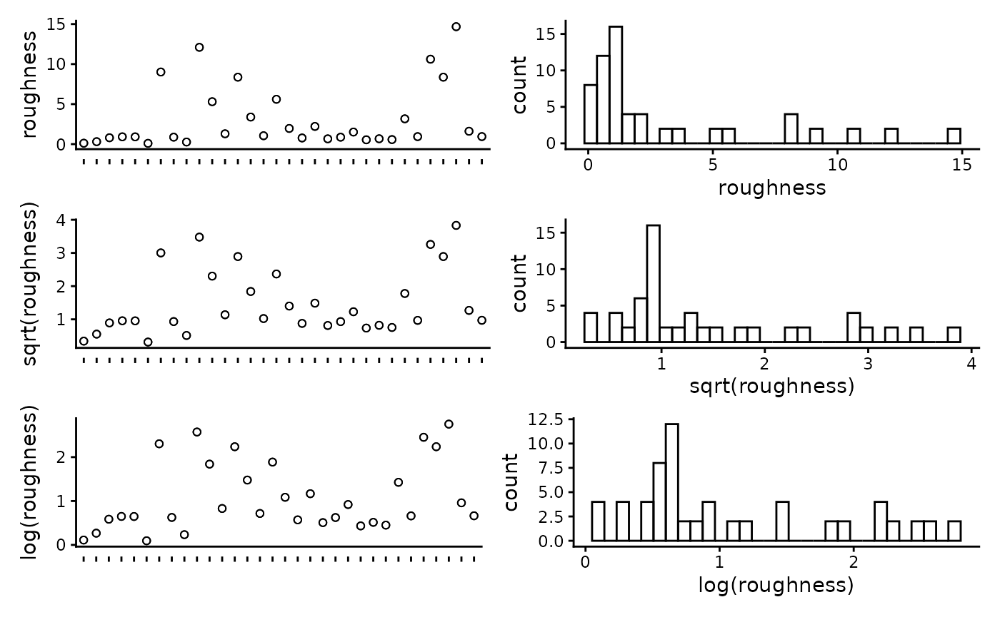
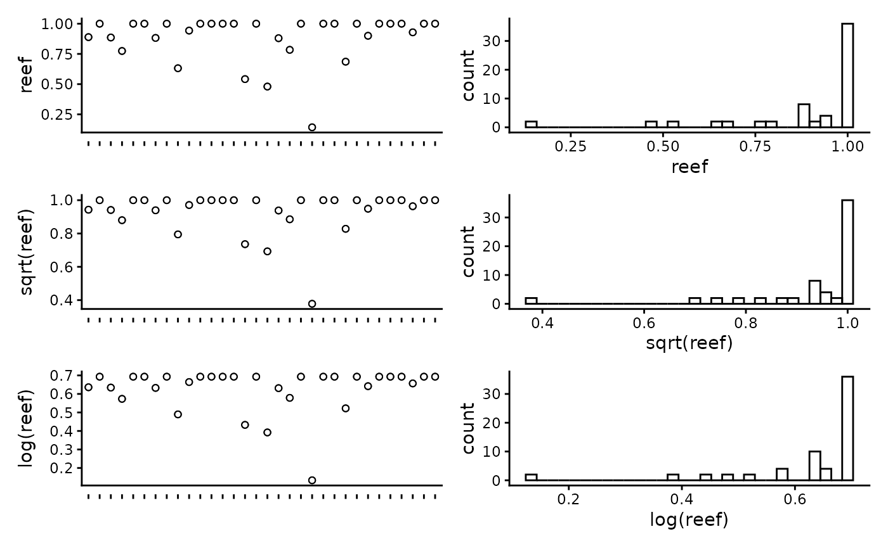

# Select top models for fish using FSSgam

This script takes the tidy datasets created in the previous steps and
runs model selection. The model selection process utilises the ‘FSSgam’
package created by Becky Fisher, to investigate relationships between
predictors and response variables, and create sensible models. Once an
appropriate model has been chosen by the user, we then provide R script
to spatially predict the response variables and plot these in a tidy
format.

## R setup

Load libraries. All packages are available through CRAN, aside from
‘FSSgam’, which can be installed following the instructions provided in
the GitHub repository <https://github.com/beckyfisher/FSSgam>.

``` r
# install.packages('remotes')
library('remotes')
options(timeout=9999999)
# remotes::install_github("GlobalArchiveManual/CheckEM")
library(CheckEM)
library(tidyverse)
library(mgcv)
library(devtools)
library(FSSgam)
library(here)
library(ggplot2)
library(ggnewscale)
library(viridis)
library(terra)
library(sf)
library(patchwork)
```

Set the study name. Study names are used throughout to make for
reproducible code that can be easily shifted between different campaigns
and projects while still providing meaningful filenames.

``` r
name <- 'example-bruv-workflow'
```

Load the fish count data. This data is created in the previous workflow,
‘Format & visualise fish data’.

``` r
tidy.count <- readRDS(here::here(paste0('r-workflows/data/tidy/',
                      name,'_tidy-count.rds'))) %>%
  dplyr::filter(!is.na(mbdepth)) %>% # If this filters out any then you need to go back and create your spatial layers
  glimpse()
```

    ## Rows: 64
    ## Columns: 18
    ## $ campaignid   <chr> "2023-03_SwC_stereo-BRUVs", "2023-03_SwC_stereo-BRUVs", "…
    ## $ sample       <chr> "10", "10", "12", "12", "14", "14", "15", "15", "16", "16…
    ## $ status       <chr> "No-take", "No-take", "No-take", "No-take", "No-take", "N…
    ## $ response     <chr> "total_abundance", "species_richness", "total_abundance",…
    ## $ number       <dbl> 111, 13, 94, 15, 191, 9, 146, 16, 99, 14, 312, 18, 38, 13…
    ## $ longitude_dd <dbl> 114.8533, 114.8533, 114.8816, 114.8816, 114.8686, 114.868…
    ## $ latitude_dd  <dbl> -34.08387, -34.08387, -34.13249, -34.13249, -34.07530, -3…
    ## $ depth_m      <chr> "44.3", "44.3", "42.6", "42.6", "42.7", "42.7", "45.3", "…
    ## $ mbdepth      <dbl> -42.77519, -42.77519, -42.02835, -42.02835, -41.07679, -4…
    ## $ slope        <dbl> 0.005708777, 0.005708777, 0.013768068, 0.013768068, 0.078…
    ## $ aspect       <dbl> 72.31942, 72.31942, 110.35012, 110.35012, 215.54254, 215.…
    ## $ tpi          <dbl> 0.05208921, 0.05208921, 0.03892708, 0.03892708, 0.2611088…
    ## $ tri          <dbl> 0.05208921, 0.05208921, 0.06246567, 0.06246567, 0.3096442…
    ## $ roughness    <dbl> 0.11757660, 0.11757660, 0.30690765, 0.30690765, 0.7959022…
    ## $ detrended    <dbl> -2.8542883, -2.8542883, -5.8822656, -5.8822656, -6.646017…
    ## $ mean_relief  <dbl> 3.217391, 3.217391, 2.809524, 2.809524, 2.440000, 2.44000…
    ## $ sd_relief    <dbl> 0.7952428, 0.7952428, 0.4023739, 0.4023739, 0.7118052, 0.…
    ## $ reef         <dbl> 0.8888889, 0.8888889, 1.0000000, 1.0000000, 0.8857143, 0.…

## Set up data for modelling

Set the potential predictor variables that may be used to explain the
patterns found in the response variables. It is important here to select
ecologically meaningful variables that could influence the chosen
response variable.

``` r
pred.vars <- c("mbdepth", "roughness", "slope", "detrended",
               "tpi", "tri", "aspect", "reef")
```

Create a correlation matrix to assess correlations between predictor
variables. If any variables have a correlation greater than 0.95, then
only one of these variables should be included in the model selection.
In this example data set, ‘roughness’, ‘slope’ and ‘tri’ are all highly
correlated, so we will only include roughness as a final predictor
variable.

``` r
round(cor(tidy.count[ , pred.vars]), 2)
```

    ##           mbdepth roughness slope detrended   tpi   tri aspect  reef
    ## mbdepth      1.00     -0.66 -0.65     -0.89  0.03 -0.59  -0.32 -0.19
    ## roughness   -0.66      1.00  0.99      0.48  0.29  0.99   0.06  0.20
    ## slope       -0.65      0.99  1.00      0.47  0.29  0.99   0.06  0.19
    ## detrended   -0.89      0.48  0.47      1.00  0.00  0.42   0.39  0.35
    ## tpi          0.03      0.29  0.29      0.00  1.00  0.35  -0.02  0.00
    ## tri         -0.59      0.99  0.99      0.42  0.35  1.00   0.04  0.21
    ## aspect      -0.32      0.06  0.06      0.39 -0.02  0.04   1.00  0.00
    ## reef        -0.19      0.20  0.19      0.35  0.00  0.21   0.00  1.00

Plot the individual predictors to assess if any transformations are
necessary. We suggest to only use transformations when absolutely
necessary. In the example data set, most of the response variables have
relatively balanced distributions, and therefor we have left them
untransformed. It is important to note that in this example dataset, the
spread of most predictor variables across their full range is not ideal,
with gaps in key predictors such as depth and detrended bathymetry. When
working with GAMs, gaps and outliers like this may create spurious
relationships, and therefor we suggest running these scripts with more
complete data than the small example data set provided here.

``` r
CheckEM::plot_transformations(pred.vars = pred.vars, dat = tidy.count)
```



Reset the predictor variables to remove any highly correlated variables
and include any transformed variables.

``` r
pred.vars <- c("mbdepth", "roughness", "detrended",
               "tpi", "aspect", "reef")
```

Check to make sure response variables have less than 80% zeroes.
Full-subset GAM modelling will produce unreliable results if your data
is too zero inflated.

``` r
unique.vars <- unique(as.character(tidy.count$response))

resp.vars <- character()
for(i in 1:length(unique.vars)){
  temp.dat <- tidy.count[which(tidy.count$response == unique.vars[i]), ]
  if(length(which(temp.dat$number == 0)) / nrow(temp.dat) < 0.8){
    resp.vars <- c(resp.vars, unique.vars[i])}
}
resp.vars
```

    ## [1] "total_abundance"  "species_richness"

Add the directory to save model outputs, and set up the R environment
for model selection.

``` r
outdir <- ("r-workflows/model-output/fish/")
out.all <- list()
var.imp <- list()
```

## Run the full subset model selection process for count metrics

This loop has been adapted from @beckyfisher/FSSgam, and examples and
documentation is available on GitHub and in Fisher, R, Wilson, SK, Sin,
TM, Lee, AC, Langlois, TJ. A simple function for full-subsets multiple
regression in ecology with R. Ecol Evol. 2018; 8: 6104–6113.
<https://doi.org/10.1002/ece3.4134>.

``` r
for(i in 1:length(resp.vars)){
  use.dat = as.data.frame(tidy.count[which(tidy.count$response == resp.vars[i]),])
  print(resp.vars[i])

  Model1  <- gam(number ~ s(mbdepth, k = 3, bs = 'cr'),
                 family = gaussian(link = "identity"),  data = use.dat)

  model.set <- generate.model.set(use.dat = use.dat,
                               test.fit = Model1,
                               pred.vars.cont = pred.vars,
                               factor.smooth.interactions = NA,
                               cyclic.vars = "aspect",
                               k = 3)
  out.list <- fit.model.set(model.set,
                         max.models = 600,
                         parallel = T)
  names(out.list)

  out.list$failed.models
  mod.table = out.list$mod.data.out
  mod.table = mod.table[order(mod.table$AICc),]
  mod.table$cumsum.wi = cumsum(mod.table$wi.AICc)
  out.i = mod.table[which(mod.table$delta.AICc <= 2),]
  out.all = c(out.all,list(out.i))
  var.imp = c(var.imp,list(out.list$variable.importance$aic$variable.weights.raw))

  for(m in 1:nrow(out.i)){
    best.model.name = as.character(out.i$modname[m])
    png(file = here::here(paste(outdir, paste(name, m, resp.vars[i], "mod_fits.png", sep = "_"), sep = "/")))
    if(best.model.name != "null"){
      par(mfrow = c(3,1), mar = c(9, 4, 3, 1))
      best.model = out.list$success.models[[best.model.name]]
      plot(best.model, all.terms = T,pages = 1,residuals = T,pch = 16)
      mtext(side = 2, text = resp.vars[i], outer = F)}
    dev.off()
  }
}
```

Tidy the model fits and importance scores. These will be combined with
the models fits and importance scores from the model selection for
lenght metrics.

``` r
names(out.all) <- resp.vars
names(var.imp) <- resp.vars
all.mod.fits <- list_rbind(out.all, names_to = "response")
all.var.imp  <- as.data.frame(do.call("rbind", var.imp))
```

Load the fish length data. This data is created in the previous
workflow, ‘Format & visualise fish data’.

``` r
tidy.length <- readRDS(here::here(paste0('r-workflows/data/tidy/',
                      name,'_tidy-length.rds'))) %>%
  dplyr::filter(!is.na(mbdepth)) %>% # If this filters out any then you need to go back and create your spatial layers
  glimpse()
```

    ## Rows: 64
    ## Columns: 18
    ## $ campaignid   <chr> "2023-03_SwC_stereo-BRUVs", "2023-03_SwC_stereo-BRUVs", "…
    ## $ sample       <chr> "15", "17", "19", "23", "24", "26", "29", "3", "31", "32"…
    ## $ number       <dbl> 1, 1, 8, 3, 2, 4, 4, 1, 4, 6, 1, 3, 1, 3, 4, 2, 6, 1, 13,…
    ## $ status       <chr> "No-take", "No-take", "No-take", "No-take", "No-take", "N…
    ## $ response     <chr> "greater than Lm", "greater than Lm", "greater than Lm", …
    ## $ longitude_dd <dbl> 114.8444, 114.8576, 114.7822, 114.9190, 114.8485, 114.928…
    ## $ latitude_dd  <dbl> -34.08478, -34.09635, -34.12047, -34.12832, -34.11789, -3…
    ## $ depth_m      <chr> "45.3", "43.3", "73.6", "41", "45.6", "36", "42.6", "46.7…
    ## $ mbdepth      <dbl> -44.29804, -42.74676, -71.60112, -38.25594, -44.23959, -4…
    ## $ slope        <dbl> 0.108975978, 0.008719478, 0.880997142, 0.444838455, 0.103…
    ## $ aspect       <dbl> 264.03427, 30.76545, 262.35388, 294.10675, 257.20307, 40.…
    ## $ tpi          <dbl> -0.19527912, 0.02505112, 1.04176044, 0.47694588, 0.042278…
    ## $ tri          <dbl> 0.34487247, 0.03473282, 2.80258274, 1.83670998, 0.3347983…
    ## $ roughness    <dbl> 0.91366196, 0.09923935, 9.01136017, 5.30128479, 1.2933082…
    ## $ detrended    <dbl> -0.2281526, -3.1375041, 17.9911461, -8.6934719, 2.9724391…
    ## $ mean_relief  <dbl> 2.518519, 3.333333, 2.583333, 3.555556, 3.360000, 4.00000…
    ## $ sd_relief    <dbl> 0.8024180, 0.9128709, 0.5036102, 0.8555853, 0.4898979, 0.…
    ## $ reef         <dbl> 0.7741935, 1.0000000, 0.8823529, 1.0000000, 1.0000000, 1.…

Check to make sure response variables have less than 80% zeroes.
Full-subset GAM modelling will produce unreliable results if your data
is too zero inflated.

``` r
unique.vars <- unique(as.character(tidy.length$response))

resp.vars <- character()
for(i in 1:length(unique.vars)){
  temp.dat <- tidy.length[which(tidy.length$response == unique.vars[i]), ]
  if(length(which(temp.dat$number == 0)) / nrow(temp.dat) < 0.8){
    resp.vars <- c(resp.vars, unique.vars[i])}
}
resp.vars
```

    ## [1] "greater than Lm"

Set up the R environment for model selection.

``` r
out.all = list()
var.imp = list()
```

## Run the full subset model selection process for length metrics

This loop has been adapted from @beckyfisher/FSSgam, and examples and
documentation is available on GitHub and in Fisher, R, Wilson, SK, Sin,
TM, Lee, AC, Langlois, TJ. A simple function for full-subsets multiple
regression in ecology with R. Ecol Evol. 2018; 8: 6104–6113.
<https://doi.org/10.1002/ece3.4134>.

``` r
for(i in 1:length(resp.vars)){
  use.dat = as.data.frame(tidy.length[which(tidy.length$response == resp.vars[i]),])
  print(resp.vars[i])

  Model1  <- gam(number ~ s(mbdepth, k = 3, bs = 'cr'),
                 family = tw(),  data = use.dat)

  model.set <- generate.model.set(use.dat = use.dat,
                               test.fit = Model1,
                               pred.vars.cont = pred.vars,
                               factor.smooth.interactions = NA,
                               cyclic.vars = "aspect",
                               k = 3
                               )
  out.list <- fit.model.set(model.set,
                         max.models = 600,
                         parallel = T)
  names(out.list)

  out.list$failed.models
  mod.table = out.list$mod.data.out
  mod.table = mod.table[order(mod.table$AICc),]
  mod.table$cumsum.wi = cumsum(mod.table$wi.AICc)
  out.i = mod.table[which(mod.table$delta.AICc<=2),]
  out.all = c(out.all, list(out.i))
  var.imp = c(var.imp, list(out.list$variable.importance$aic$variable.weights.raw))

  for(m in 1:nrow(out.i)){
    best.model.name = as.character(out.i$modname[m])
    png(file = here::here(paste(outdir, paste(name, m, resp.vars[i], "mod_fits.png", sep = "_"), sep = "/")))
    if(best.model.name != "null"){
      par(mfrow = c(3,1), mar = c(9, 4, 3, 1))
      best.model = out.list$success.models[[best.model.name]]
      plot(best.model, all.terms = T, pages = 1, residuals = T, pch = 16)
      mtext(side = 2, text = resp.vars[i], outer = F)}
    dev.off()
  }
}
```

Combine the model fits and importance scores with those previously
created in full subsets modelling of count metrics, and save out these
files.

``` r
names(out.all) <- resp.vars
names(var.imp) <- resp.vars
all.mod.fits <- bind_rows(all.mod.fits, list_rbind(out.all, names_to = "response"))
all.var.imp  <- bind_rows(all.var.imp, as.data.frame(do.call("rbind",var.imp)))
write.csv(all.mod.fits[ , -2], file = here::here(paste0(outdir, name, "_all.mod.fits.csv")))
write.csv(all.var.imp,         file = here::here(paste0(outdir, name, "_all.var.imp.csv")))
```
