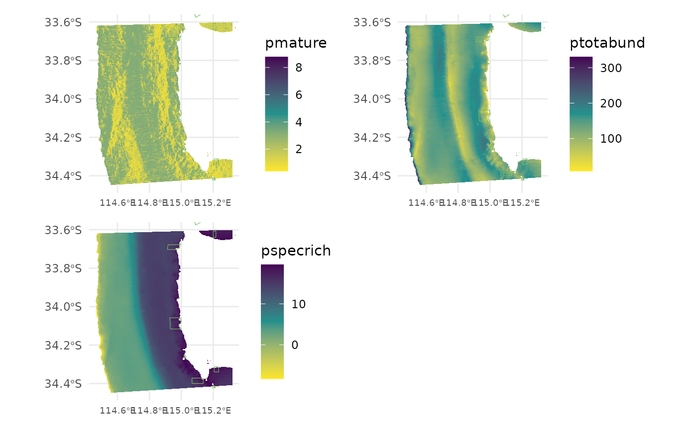

# Spatially predict fish distributions

This script takes the tidy datasets created in the previous steps, uses
the top models created in ‘Select top models for fish using FSSgam’.
Once an appropriate model has been chosen by the user, we then provide R
script to spatially predict the response variables and plot these in a
tidy format.

## R setup

Load libraries. All packages are available through CRAN, aside from
‘FSSgam’, which can be installed following the instructions provided in
the GitHub repository <https://github.com/beckyfisher/FSSgam>.

``` r
# install.packages('remotes')
library('remotes')
options(timeout=9999999)
# remotes::install_github("GlobalArchiveManual/CheckEM")
library(CheckEM)
library(tidyverse)
library(mgcv)
library(devtools)
library(FSSgam)
library(here)
library(ggplot2)
library(ggnewscale)
library(viridis)
library(terra)
library(sf)
library(patchwork)
```

Set the study name. Study names are used throughout to make for
reproducible code that can be easily shifted between different campaigns
and projects while still providing meaningful filenames.

``` r
name <- 'example-bruv-workflow'
```

Load the fish length data. This data is created in the previous
workflow, ‘Format & visualise fish data’.

``` r
tidy.length <- readRDS(here::here(paste0('r-workflows/data/tidy/',
                      name,'_tidy-length.rds'))) %>%
  dplyr::filter(!is.na(mbdepth)) %>% # If this filters out any then you need to go back and create your spatial layers
  glimpse()
```

    ## Rows: 64
    ## Columns: 18
    ## $ campaignid   <chr> "2023-03_SwC_stereo-BRUVs", "2023-03_SwC_stereo-BRUVs", "…
    ## $ sample       <chr> "15", "17", "19", "23", "24", "26", "29", "3", "31", "32"…
    ## $ number       <dbl> 1, 1, 8, 3, 2, 4, 4, 1, 4, 6, 1, 3, 1, 3, 4, 2, 6, 1, 13,…
    ## $ status       <chr> "No-take", "No-take", "No-take", "No-take", "No-take", "N…
    ## $ response     <chr> "greater than Lm", "greater than Lm", "greater than Lm", …
    ## $ longitude_dd <dbl> 114.8444, 114.8576, 114.7822, 114.9190, 114.8485, 114.928…
    ## $ latitude_dd  <dbl> -34.08478, -34.09635, -34.12047, -34.12832, -34.11789, -3…
    ## $ depth_m      <chr> "45.3", "43.3", "73.6", "41", "45.6", "36", "42.6", "46.7…
    ## $ mbdepth      <dbl> -44.29804, -42.74676, -71.60112, -38.25594, -44.23959, -4…
    ## $ slope        <dbl> 0.108975978, 0.008719478, 0.880997142, 0.444838455, 0.103…
    ## $ aspect       <dbl> 264.03427, 30.76545, 262.35388, 294.10675, 257.20307, 40.…
    ## $ tpi          <dbl> -0.19527912, 0.02505112, 1.04176044, 0.47694588, 0.042278…
    ## $ tri          <dbl> 0.34487247, 0.03473282, 2.80258274, 1.83670998, 0.3347983…
    ## $ roughness    <dbl> 0.91366196, 0.09923935, 9.01136017, 5.30128479, 1.2933082…
    ## $ detrended    <dbl> -0.2281526, -3.1375041, 17.9911461, -8.6934719, 2.9724391…
    ## $ mean_relief  <dbl> 2.518519, 3.333333, 2.583333, 3.555556, 3.360000, 4.00000…
    ## $ sd_relief    <dbl> 0.8024180, 0.9128709, 0.5036102, 0.8555853, 0.4898979, 0.…
    ## $ reef         <dbl> 0.7741935, 1.0000000, 0.8823529, 1.0000000, 1.0000000, 1.…

Load the fish count data. This data is created in the previous workflow,
‘Format & visualise fish data’.

``` r
tidy.count <- readRDS(here::here(paste0('r-workflows/data/tidy/',
                      name,'_tidy-count.rds'))) %>%
  dplyr::filter(!is.na(mbdepth)) %>% # If this filters out any then you need to go back and create your spatial layers
  glimpse()
```

    ## Rows: 64
    ## Columns: 18
    ## $ campaignid   <chr> "2023-03_SwC_stereo-BRUVs", "2023-03_SwC_stereo-BRUVs", "…
    ## $ sample       <chr> "10", "10", "12", "12", "14", "14", "15", "15", "16", "16…
    ## $ status       <chr> "No-take", "No-take", "No-take", "No-take", "No-take", "N…
    ## $ response     <chr> "total_abundance", "species_richness", "total_abundance",…
    ## $ number       <dbl> 111, 13, 94, 15, 191, 9, 146, 16, 99, 14, 312, 18, 38, 13…
    ## $ longitude_dd <dbl> 114.8533, 114.8533, 114.8816, 114.8816, 114.8686, 114.868…
    ## $ latitude_dd  <dbl> -34.08387, -34.08387, -34.13249, -34.13249, -34.07530, -3…
    ## $ depth_m      <chr> "44.3", "44.3", "42.6", "42.6", "42.7", "42.7", "45.3", "…
    ## $ mbdepth      <dbl> -42.77519, -42.77519, -42.02835, -42.02835, -41.07679, -4…
    ## $ slope        <dbl> 0.005708777, 0.005708777, 0.013768068, 0.013768068, 0.078…
    ## $ aspect       <dbl> 72.31942, 72.31942, 110.35012, 110.35012, 215.54254, 215.…
    ## $ tpi          <dbl> 0.05208921, 0.05208921, 0.03892708, 0.03892708, 0.2611088…
    ## $ tri          <dbl> 0.05208921, 0.05208921, 0.06246567, 0.06246567, 0.3096442…
    ## $ roughness    <dbl> 0.11757660, 0.11757660, 0.30690765, 0.30690765, 0.7959022…
    ## $ detrended    <dbl> -2.8542883, -2.8542883, -5.8822656, -5.8822656, -6.646017…
    ## $ mean_relief  <dbl> 3.217391, 3.217391, 2.809524, 2.809524, 2.440000, 2.44000…
    ## $ sd_relief    <dbl> 0.7952428, 0.7952428, 0.4023739, 0.4023739, 0.7118052, 0.…
    ## $ reef         <dbl> 0.8888889, 0.8888889, 1.0000000, 1.0000000, 0.8857143, 0.…

Combine the count and length data for easy spatial prediction.

``` r
dat <- bind_rows(tidy.count, tidy.length) %>%
  glimpse()
```

    ## Rows: 128
    ## Columns: 18
    ## $ campaignid   <chr> "2023-03_SwC_stereo-BRUVs", "2023-03_SwC_stereo-BRUVs", "…
    ## $ sample       <chr> "10", "10", "12", "12", "14", "14", "15", "15", "16", "16…
    ## $ status       <chr> "No-take", "No-take", "No-take", "No-take", "No-take", "N…
    ## $ response     <chr> "total_abundance", "species_richness", "total_abundance",…
    ## $ number       <dbl> 111, 13, 94, 15, 191, 9, 146, 16, 99, 14, 312, 18, 38, 13…
    ## $ longitude_dd <dbl> 114.8533, 114.8533, 114.8816, 114.8816, 114.8686, 114.868…
    ## $ latitude_dd  <dbl> -34.08387, -34.08387, -34.13249, -34.13249, -34.07530, -3…
    ## $ depth_m      <chr> "44.3", "44.3", "42.6", "42.6", "42.7", "42.7", "45.3", "…
    ## $ mbdepth      <dbl> -42.77519, -42.77519, -42.02835, -42.02835, -41.07679, -4…
    ## $ slope        <dbl> 0.005708777, 0.005708777, 0.013768068, 0.013768068, 0.078…
    ## $ aspect       <dbl> 72.31942, 72.31942, 110.35012, 110.35012, 215.54254, 215.…
    ## $ tpi          <dbl> 0.05208921, 0.05208921, 0.03892708, 0.03892708, 0.2611088…
    ## $ tri          <dbl> 0.05208921, 0.05208921, 0.06246567, 0.06246567, 0.3096442…
    ## $ roughness    <dbl> 0.11757660, 0.11757660, 0.30690765, 0.30690765, 0.7959022…
    ## $ detrended    <dbl> -2.8542883, -2.8542883, -5.8822656, -5.8822656, -6.646017…
    ## $ mean_relief  <dbl> 3.217391, 3.217391, 2.809524, 2.809524, 2.440000, 2.44000…
    ## $ sd_relief    <dbl> 0.7952428, 0.7952428, 0.4023739, 0.4023739, 0.7118052, 0.…
    ## $ reef         <dbl> 0.8888889, 0.8888889, 1.0000000, 1.0000000, 0.8857143, 0.…

Read in the bathymetry derivatives.

``` r
preds  <- readRDS(here::here(paste0("r-workflows/data/spatial/rasters/",
                         name, "_bathymetry_derivatives.rds")))
plot(preds)
```


Transform the spatial bathymetry derivatives into a dataframe to predict
onto.

``` r
preddf <- as.data.frame(preds, xy = TRUE, na.rm = TRUE) %>%
  clean_names() %>%
  glimpse()
```

    ## Rows: 73,350
    ## Columns: 9
    ## $ x         <dbl> 115.1714, 115.1739, 115.1764, 115.1789, 115.1814, 115.1839, …
    ## $ y         <dbl> -33.60361, -33.60361, -33.60361, -33.60361, -33.60361, -33.6…
    ## $ mbdepth   <dbl> -14.83014, -13.89184, -14.18757, -14.48647, -14.47323, -14.3…
    ## $ slope     <dbl> 0.24350203, 0.19746646, 0.17799167, 0.18316828, 0.22091857, …
    ## $ aspect    <dbl> 339.995240, 341.597571, 21.180346, 12.600024, 356.337121, 35…
    ## $ tpi       <dbl> -3.721524e-01, 5.277313e-01, 1.502453e-01, -1.123428e-03, 9.…
    ## $ tri       <dbl> 0.9656481, 0.8277034, 0.6934198, 0.6945946, 0.8081013, 0.902…
    ## $ roughness <dbl> 2.807414, 2.421717, 2.196986, 2.156502, 2.581898, 2.606502, …
    ## $ detrended <dbl> -2.871674, -2.161609, -2.683798, -3.207528, -3.417629, -3.56…

Manually set the best model from the full subsets model selection
process. We select the ‘best’ model as the most parsimonious model
within 2 AICc of the lowest AICc. We suggest you select your models
using statistically rigorous criteria that best suits your analysis or
project.

``` r
# Indicator species greater than size of maturity
m_mature <- gam(number ~
                 s(aspect, k = 3, bs = "cc") +
                  s(tpi, k = 3, bs = "cr"),
               data = dplyr::filter(dat, response %in% "greater than Lm"),
               family = tw())
```

    ## Warning in smooth.construct.cc.smooth.spec(object, dk$data, dk$knots): basis dimension, k, increased to minimum possible

``` r
summary(m_mature)
```

    ## 
    ## Family: Tweedie(p=1.28) 
    ## Link function: log 
    ## 
    ## Formula:
    ## number ~ s(aspect, k = 3, bs = "cc") + s(tpi, k = 3, bs = "cr")
    ## 
    ## Parametric coefficients:
    ##             Estimate Std. Error t value Pr(>|t|)   
    ## (Intercept)   0.7598     0.2149   3.536  0.00141 **
    ## ---
    ## Signif. codes:  0 '***' 0.001 '**' 0.01 '*' 0.05 '.' 0.1 ' ' 1
    ## 
    ## Approximate significance of smooth terms:
    ##            edf Ref.df     F p-value  
    ## s(aspect) 1.41      2 2.191   0.060 .
    ## s(tpi)    1.00      1 0.099   0.756  
    ## ---
    ## Signif. codes:  0 '***' 0.001 '**' 0.01 '*' 0.05 '.' 0.1 ' ' 1
    ## 
    ## R-sq.(adj) =  0.034   Deviance explained =   14%
    ## -REML = 64.507  Scale est. = 2.4996    n = 32

``` r
plot(m_mature, pages = 1, residuals = T, cex = 5)
```


``` r
# Total abundance
m_totabund <- gam(number ~
                  s(detrended, k = 3, bs = "cr"),
                data = dplyr::filter(dat, response %in% "total_abundance"),
                family = gaussian(link = "identity"))
summary(m_totabund)
```

    ## 
    ## Family: gaussian 
    ## Link function: identity 
    ## 
    ## Formula:
    ## number ~ s(detrended, k = 3, bs = "cr")
    ## 
    ## Parametric coefficients:
    ##             Estimate Std. Error t value Pr(>|t|)    
    ## (Intercept)   131.22      13.24   9.913 5.61e-11 ***
    ## ---
    ## Signif. codes:  0 '***' 0.001 '**' 0.01 '*' 0.05 '.' 0.1 ' ' 1
    ## 
    ## Approximate significance of smooth terms:
    ##              edf Ref.df     F p-value   
    ## s(detrended)   1      1 8.602 0.00638 **
    ## ---
    ## Signif. codes:  0 '***' 0.001 '**' 0.01 '*' 0.05 '.' 0.1 ' ' 1
    ## 
    ## R-sq.(adj) =  0.197   Deviance explained = 22.3%
    ## GCV = 5981.2  Scale est. = 5607.4    n = 32

``` r
plot(m_totabund, pages = 1, residuals = T, cex = 5)
```


``` r
# Species richness
m_specrich <- gam(number ~
                    s(mbdepth, k = 3, bs = "cr"),
                  data = dplyr::filter(dat, response %in% "species_richness"),
                  family = gaussian(link = "identity"))
summary(m_specrich)
```

    ## 
    ## Family: gaussian 
    ## Link function: identity 
    ## 
    ## Formula:
    ## number ~ s(mbdepth, k = 3, bs = "cr")
    ## 
    ## Parametric coefficients:
    ##             Estimate Std. Error t value Pr(>|t|)    
    ## (Intercept)  13.9688     0.6462   21.62   <2e-16 ***
    ## ---
    ## Signif. codes:  0 '***' 0.001 '**' 0.01 '*' 0.05 '.' 0.1 ' ' 1
    ## 
    ## Approximate significance of smooth terms:
    ##            edf Ref.df     F p-value  
    ## s(mbdepth)   1      1 3.904  0.0574 .
    ## ---
    ## Signif. codes:  0 '***' 0.001 '**' 0.01 '*' 0.05 '.' 0.1 ' ' 1
    ## 
    ## R-sq.(adj) =  0.0856   Deviance explained = 11.5%
    ## GCV = 14.251  Scale est. = 13.36     n = 32

``` r
plot(m_specrich, pages = 1, residuals = T, cex = 5)
```


Predict each of the response variables across the extent of the
bathymetry derivatives.

``` r
preddf <- cbind(preddf,
                "pmature" = predict(m_mature, preddf, type = "response"),
                "ptotabund" = predict(m_totabund, preddf, type = "response"),
                "pspecrich" = predict(m_specrich, preddf, type = "response")) %>%
  glimpse()
```

    ## Rows: 73,350
    ## Columns: 12
    ## $ x         <dbl> 115.1714, 115.1739, 115.1764, 115.1789, 115.1814, 115.1839, …
    ## $ y         <dbl> -33.60361, -33.60361, -33.60361, -33.60361, -33.60361, -33.6…
    ## $ mbdepth   <dbl> -14.83014, -13.89184, -14.18757, -14.48647, -14.47323, -14.3…
    ## $ slope     <dbl> 0.24350203, 0.19746646, 0.17799167, 0.18316828, 0.22091857, …
    ## $ aspect    <dbl> 339.995240, 341.597571, 21.180346, 12.600024, 356.337121, 35…
    ## $ tpi       <dbl> -3.721524e-01, 5.277313e-01, 1.502453e-01, -1.123428e-03, 9.…
    ## $ tri       <dbl> 0.9656481, 0.8277034, 0.6934198, 0.6945946, 0.8081013, 0.902…
    ## $ roughness <dbl> 2.807414, 2.421717, 2.196986, 2.156502, 2.581898, 2.606502, …
    ## $ detrended <dbl> -2.871674, -2.161609, -2.683798, -3.207528, -3.417629, -3.56…
    ## $ pmature   <dbl> 1.876505, 1.655808, 1.858302, 2.095686, 1.496932, 1.500510, …
    ## $ ptotabund <dbl> 140.7683, 138.4064, 140.1434, 141.8855, 142.5844, 143.0622, …
    ## $ pspecrich <dbl> 17.83208, 17.94093, 17.90662, 17.87195, 17.87349, 17.88257, …

Save out the spatial predictions. If your computer crashes this way you
don’t need to run the whole script again.

``` r
saveRDS(preddf, file = here::here(paste0("r-workflows/model-output/fish/",
                              name, "_fish-prediction.RDS")))
```

Pivot the data to long format for easy plotting.

``` r
dat <- preddf %>%
  dplyr::select(x, y, starts_with("p")) %>%
  pivot_longer(names_to = "response", values_to = "value",
               cols = !c(x, y)) %>%
  glimpse()
```

    ## Rows: 220,050
    ## Columns: 4
    ## $ x        <dbl> 115.1714, 115.1714, 115.1714, 115.1739, 115.1739, 115.1739, 1…
    ## $ y        <dbl> -33.60361, -33.60361, -33.60361, -33.60361, -33.60361, -33.60…
    ## $ response <chr> "pmature", "ptotabund", "pspecrich", "pmature", "ptotabund", …
    ## $ value    <dbl> 1.876505, 140.768348, 17.832085, 1.655808, 138.406351, 17.940…

Reset the response variables to loop through when plotting.

``` r
resp.vars <- unique(dat$response)
```

Load marine park data. The dataset used here is the 2022 Collaborative
Australian Protected Areas Database, which is available for free
download from
<https://fed.dcceew.gov.au/datasets/782c02c691014efe8ffbd27445fe41d7_0/explore>.
Feel free to replace this shapefile with any suitable dataset that is
available for your study area.

``` r
marine.parks <- st_read(here::here("r-workflows/data/spatial/shapefiles/Collaborative_Australian_Protected_Areas_Database_(CAPAD)_2022_-_Marine.shp")) %>%
  st_make_valid() %>%
  dplyr::mutate(ZONE_TYPE = str_replace_all(ZONE_TYPE,
                                            "\\s*\\([^\\)]+\\)", "")) %>%
  dplyr::filter(str_detect(ZONE_TYPE, "Sanctuary|National Park"),
                STATE %in% "WA") %>%
  st_transform(4326)
```

    ## Reading layer `Collaborative_Australian_Protected_Areas_Database_(CAPAD)_2022_-_Marine' from data source `/home/runner/work/CheckEM/CheckEM/r-workflows/data/spatial/shapefiles/Collaborative_Australian_Protected_Areas_Database_(CAPAD)_2022_-_Marine.shp' 
    ##   using driver `ESRI Shapefile'
    ## Simple feature collection with 3775 features and 26 fields
    ## Geometry type: MULTIPOLYGON
    ## Dimension:     XY
    ## Bounding box:  xmin: 70.71702 ymin: -58.44947 xmax: 170.3667 ymax: -8.473407
    ## Geodetic CRS:  WGS 84

Loop through each response variable and create a ggplot figure for each.

``` r
for (i in 1:length(resp.vars)) {
  use.dat <- dat %>%
    dplyr::filter(response %in% resp.vars[i])

  p <- ggplot() +
    geom_tile(data = use.dat, aes(x, y, fill = value)) +
    scale_fill_gradientn(colours = c("#fde725", "#21918c", "#440154"), na.value = "transparent") +
    labs(fill = resp.vars[i], x = NULL, y = NULL) +
    new_scale_fill() +
    geom_sf(data = marine.parks, fill = NA, colour = "#7bbc63",
            size = 0.2, show.legend = F) +
    coord_sf(xlim = c(min(dat$x), max(dat$x)),
             ylim = c(min(dat$y), max(dat$y))) +
    theme_minimal() +
    theme(axis.text.x = element_text(size = 7))
  assign(paste0("gg_", resp.vars[i]), p)
}
```

Combine the plots using patchwork.

``` r
gg_pmature + gg_ptotabund + gg_pspecrich +
  theme(legend.justification = "left") +
  plot_layout(ncol = 2, nrow = 2)
```


