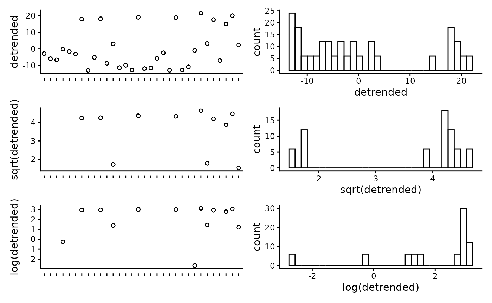
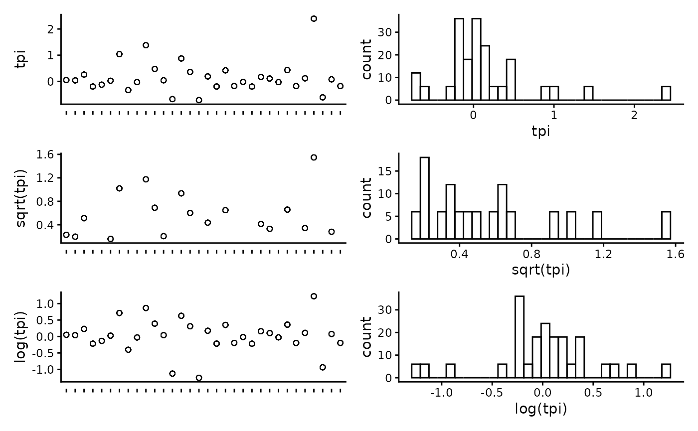
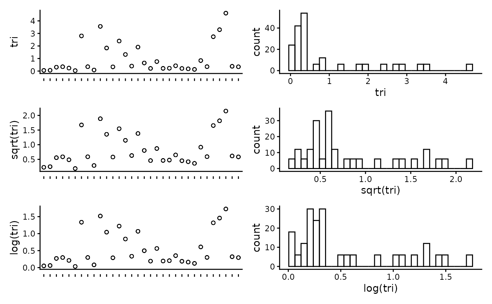

# Generate spatial predictions of habitat using FSSgam

This script takes the checked habitat data from the previous workflow
steps, visualises the data and exports it into a format suitable for
modelling. The exploratory visualisation of the data allows for trends
and patterns in the raw data to be investigated.

## R setup

Load libraries.

``` r
library('remotes')
options(timeout=9999999)
# remotes::install_github("GlobalArchiveManual/CheckEM")
library(CheckEM)
library(tidyverse)
library(mgcv)
library(devtools)
library(FSSgam)
library(here)
library(ggplot2)
library(ggnewscale)
library(viridis)
library(terra)
library(sf)
library(patchwork)
```

Set the study name.

``` r
name <- 'example-bruv-workflow'
```

## Load data

Load the habitat point annotation data.

``` r
dat <- readRDS(here::here(paste0("r-workflows/data/tidy/",
                      name, "_tidy-habitat.rds"))) %>%
  glimpse()
```

    ## Rows: 192
    ## Columns: 27
    ## $ campaignid                  <chr> "2023-03_SwC_stereo-BRUVs", "2023-03_SwC_s…
    ## $ sample                      <chr> "35", "35", "35", "35", "35", "35", "5", "…
    ## $ date_time                   <chr> "14/03/2023 23:36", "14/03/2023 23:36", "1…
    ## $ location                    <chr> NA, NA, NA, NA, NA, NA, NA, NA, NA, NA, NA…
    ## $ site                        <chr> NA, NA, NA, NA, NA, NA, NA, NA, NA, NA, NA…
    ## $ depth_m                     <chr> "39.6", "39.6", "39.6", "39.6", "39.6", "3…
    ## $ successful_count            <chr> "Yes", "Yes", "Yes", "Yes", "Yes", "Yes", …
    ## $ successful_length           <chr> "Yes", "Yes", "Yes", "Yes", "Yes", "Yes", …
    ## $ successful_habitat_forward  <chr> "Yes", "Yes", "Yes", "Yes", "Yes", "Yes", …
    ## $ successful_habitat_backward <chr> "Yes", "Yes", "Yes", "Yes", "Yes", "Yes", …
    ## $ x                           <dbl> 114.9236, 114.9236, 114.9236, 114.9236, 11…
    ## $ y                           <dbl> -34.13155, -34.13155, -34.13155, -34.13155…
    ## $ longitude_dd                <dbl> 114.9236, 114.9236, 114.9236, 114.9236, 11…
    ## $ latitude_dd                 <dbl> -34.13155, -34.13155, -34.13155, -34.13155…
    ## $ id                          <dbl> 63, 63, 63, 63, 63, 63, 64, 64, 64, 64, 64…
    ## $ mbdepth                     <dbl> -34.97151, -34.97151, -34.97151, -34.97151…
    ## $ slope                       <dbl> 0.1468434, 0.1468434, 0.1468434, 0.1468434…
    ## $ aspect                      <dbl> 209.89577, 209.89577, 209.89577, 209.89577…
    ## $ tpi                         <dbl> 0.4215345, 0.4215345, 0.4215345, 0.4215345…
    ## $ tri                         <dbl> 0.7555733, 0.7555733, 0.7555733, 0.7555733…
    ## $ roughness                   <dbl> 2.211193, 2.211193, 2.211193, 2.211193, 2.…
    ## $ detrended                   <dbl> -5.663174, -5.663174, -5.663174, -5.663174…
    ## $ total_points_annotated      <dbl> 37, 37, 37, 37, 37, 37, 36, 36, 36, 36, 36…
    ## $ habitat                     <chr> "Macroalgae", "Seagrasses", "Sessile inver…
    ## $ count                       <dbl> 24, 1, 3, 1, 8, 29, 30, 6, 0, 0, 0, 36, 21…
    ## $ mean_relief                 <dbl> 3.034483, 3.034483, 3.034483, 3.034483, 3.…
    ## $ sd_relief                   <dbl> 1.1174831, 1.1174831, 1.1174831, 1.1174831…

## Set up data for modelling

Set the predictor variables.

``` r
names(dat)
```

    ##  [1] "campaignid"                  "sample"                     
    ##  [3] "date_time"                   "location"                   
    ##  [5] "site"                        "depth_m"                    
    ##  [7] "successful_count"            "successful_length"          
    ##  [9] "successful_habitat_forward"  "successful_habitat_backward"
    ## [11] "x"                           "y"                          
    ## [13] "longitude_dd"                "latitude_dd"                
    ## [15] "id"                          "mbdepth"                    
    ## [17] "slope"                       "aspect"                     
    ## [19] "tpi"                         "tri"                        
    ## [21] "roughness"                   "detrended"                  
    ## [23] "total_points_annotated"      "habitat"                    
    ## [25] "count"                       "mean_relief"                
    ## [27] "sd_relief"

``` r
pred.vars <- c("mbdepth","roughness", "detrended",
               "slope", "tpi", "aspect", "tri")
```

Check for correlation of predictor variables and remove anything highly
correlated (\>0.95).

``` r
round(cor(dat[ , pred.vars]), 2)
```

    ##           mbdepth roughness detrended slope   tpi aspect   tri
    ## mbdepth      1.00     -0.66     -0.89 -0.65  0.03  -0.32 -0.59
    ## roughness   -0.66      1.00      0.48  0.99  0.29   0.06  0.99
    ## detrended   -0.89      0.48      1.00  0.47  0.00   0.39  0.42
    ## slope       -0.65      0.99      0.47  1.00  0.29   0.06  0.99
    ## tpi          0.03      0.29      0.00  0.29  1.00  -0.02  0.35
    ## aspect      -0.32      0.06      0.39  0.06 -0.02   1.00  0.04
    ## tri         -0.59      0.99      0.42  0.99  0.35   0.04  1.00

Plot the individual predictors to assess if any transformations are
necessary. We suggest to only use transformations when absolutely
necessary. In the example dataset, most of the response variables have
relatively balanced distributions, and therefor we have left them
untransformed.

``` r
plot_transformations(pred.vars = pred.vars, dat = dat)
```



Reset the predictor variables to remove any highly correlated variables
and include any transformed variables.

``` r
pred.vars <- c("depth_m","roughness", "detrended",
               "tpi", "aspect", "tri")
```

Check to make sure response variables have less than 80% zeroes.
Full-subset GAM modelling will produce unreliable results if your data
is too zero inflated.

``` r
resp.vars.all = unique(as.character(dat$habitat))
resp.vars = character()
for(i in 1:length(resp.vars.all)){
  temp.dat = dat[which(dat$habitat == resp.vars.all[i]),]
  if(length(which(temp.dat$habitat == 0)) / nrow(temp.dat) < 0.8){
    resp.vars = c(resp.vars, resp.vars.all[i])}
}
resp.vars
```

    ## [1] "Macroalgae"            "Seagrasses"            "Sessile invertebrates"
    ## [4] "Consolidated (hard)"   "Unconsolidated (soft)" "reef"

Add the directory to save model outputs, and set up the R environment
for model selection.

``` r
outdir    <- ("r-workflows/model-output/habitat/")
out.all   <- list()
var.imp   <- list()
```

## Run the full subset model selection process

This loop has been adapted from @beckyfisher/FSSgam, and examples and
documentation is available on GitHub and in Fisher, R, Wilson, SK, Sin,
TM, Lee, AC, Langlois, TJ. A simple function for full-subsets multiple
regression in ecology with R. Ecol Evol. 2018; 8: 6104–6113.
<https://doi.org/10.1002/ece3.4134>

``` r
for(i in 1:length(resp.vars)){
  print(resp.vars[i])
  use.dat <- dat[dat$habitat == resp.vars[i],]
  use.dat   <- as.data.frame(use.dat)
  Model1  <- gam(cbind(count, (total_points_annotated - count)) ~
                   s(mbdepth, bs = 'cr'),
                 family = binomial("logit"),  data = use.dat)

  model.set <- generate.model.set(use.dat = use.dat,
                                  test.fit = Model1,
                                  pred.vars.cont = pred.vars,
                                  cyclic.vars = c("aspect"),
                                  k = 5,
                                  cov.cutoff = 0.7
  )
  out.list <- fit.model.set(model.set,
                            max.models = 600,
                            parallel = T)
  names(out.list)

  out.list$failed.models
  mod.table <- out.list$mod.data.out
  mod.table <- mod.table[order(mod.table$AICc), ]
  mod.table$cumsum.wi <- cumsum(mod.table$wi.AICc)
  out.i     <- mod.table[which(mod.table$delta.AICc <= 2), ]
  out.all   <- c(out.all, list(out.i))
  var.imp   <- c(var.imp, list(out.list$variable.importance$aic$variable.weights.raw))

  for(m in 1:nrow(out.i)){
    best.model.name <- as.character(out.i$modname[m])

    png(file = here::here(paste(outdir, m, resp.vars[i], "mod_fits.png", sep = "")))
    if(best.model.name != "null"){
      par(mfrow = c(3, 1), mar = c(9, 4, 3, 1))
      best.model = out.list$success.models[[best.model.name]]
      plot(best.model, all.terms = T, pages = 1, residuals = T, pch = 16)
      mtext(side = 2, text = resp.vars[i], outer = F)}
    dev.off()
  }
}
```

Save the model fits and importance scores.

``` r
names(out.all) <- resp.vars
names(var.imp) <- resp.vars
all.mod.fits <- list_rbind(out.all, names_to = "response")
all.var.imp  <- do.call("rbind",var.imp)
write.csv(all.mod.fits[ , -2], file = here::here(paste0(outdir, name, "_all.mod.fits.csv")))
write.csv(all.var.imp,         file = here::here(paste0(outdir, name, "_all.var.imp.csv")))
```

## Spatially predict the top model from the model selection process

Transform the habitat data into wide format for easy prediction.

``` r
widedat <- dat %>%
  pivot_wider(values_from = "count", names_from = "habitat", values_fill = 0) %>%
  clean_names() %>%
  glimpse()
```

    ## Rows: 32
    ## Columns: 31
    ## $ campaignid                  <chr> "2023-03_SwC_stereo-BRUVs", "2023-03_SwC_s…
    ## $ sample                      <chr> "35", "5", "26", "23", "29", "4", "32", "3…
    ## $ date_time                   <chr> "14/03/2023 23:36", "14/03/2023 23:49", "1…
    ## $ location                    <chr> NA, NA, NA, NA, NA, NA, NA, NA, NA, NA, NA…
    ## $ site                        <chr> NA, NA, NA, NA, NA, NA, NA, NA, NA, NA, NA…
    ## $ depth_m                     <chr> "39.6", "42.7", "36", "41", "42.6", "45", …
    ## $ successful_count            <chr> "Yes", "Yes", "Yes", "Yes", "Yes", "Yes", …
    ## $ successful_length           <chr> "Yes", "Yes", "Yes", "Yes", "Yes", "Yes", …
    ## $ successful_habitat_forward  <chr> "Yes", "Yes", "Yes", "Yes", "Yes", "Yes", …
    ## $ successful_habitat_backward <chr> "Yes", "Yes", "Yes", "Yes", "Yes", "Yes", …
    ## $ x                           <dbl> 114.9236, 114.9292, 114.9284, 114.9190, 11…
    ## $ y                           <dbl> -34.13155, -34.12953, -34.12729, -34.12832…
    ## $ longitude_dd                <dbl> 114.9236, 114.9292, 114.9284, 114.9190, 11…
    ## $ latitude_dd                 <dbl> -34.13155, -34.12953, -34.12729, -34.12832…
    ## $ id                          <dbl> 63, 64, 65, 66, 67, 68, 69, 70, 71, 72, 73…
    ## $ mbdepth                     <dbl> -34.97151, -36.35807, -40.68553, -38.25594…
    ## $ slope                       <dbl> 0.146843375, 0.812689749, 0.694289634, 0.4…
    ## $ aspect                      <dbl> 209.89577, 62.41434, 40.87387, 294.10675, …
    ## $ tpi                         <dbl> 0.42153454, 2.39535522, -0.67607403, 0.476…
    ## $ tri                         <dbl> 0.75557327, 3.29823494, 2.39221191, 1.8367…
    ## $ roughness                   <dbl> 2.21119308, 8.36493301, 8.36493301, 5.3012…
    ## $ detrended                   <dbl> -5.6631737, -7.0394716, -11.2637815, -8.69…
    ## $ total_points_annotated      <dbl> 37, 36, 39, 32, 36, 22, 25, 14, 24, 35, 33…
    ## $ mean_relief                 <dbl> 3.034483, 3.900000, 4.000000, 3.555556, 4.…
    ## $ sd_relief                   <dbl> 1.1174831, 0.4472136, 0.0000000, 0.8555853…
    ## $ macroalgae                  <dbl> 24, 30, 21, 14, 8, 14, 7, 1, 12, 26, 29, 2…
    ## $ seagrasses                  <dbl> 1, 6, 18, 11, 28, 6, 0, 1, 1, 9, 2, 4, 14,…
    ## $ sessile_invertebrates       <dbl> 3, 0, 0, 7, 0, 2, 2, 0, 0, 0, 2, 0, 1, 0, …
    ## $ consolidated_hard_          <dbl> 1, 0, 0, 0, 0, 0, 3, 0, 0, 0, 0, 0, 0, 0, …
    ## $ unconsolidated_soft_        <dbl> 8, 0, 0, 0, 0, 0, 13, 12, 11, 0, 0, 0, 0, …
    ## $ reef                        <dbl> 29, 36, 39, 32, 36, 22, 12, 2, 13, 35, 33,…

Load the raster of bathymetry data and derivatives.

``` r
preds  <- rast(here::here(paste0("r-workflows/data/spatial/rasters/",
                         name, "_bathymetry_derivatives.rds")))
plot(preds)
```


Transform the raster to a dataframe to predict onto.

``` r
preddf <- as.data.frame(preds, xy = TRUE, na.rm = TRUE) %>%
  dplyr::mutate(depth = abs(mbdepth)) %>%
  clean_names() %>%
  glimpse()
```

    ## Rows: 73,350
    ## Columns: 10
    ## $ x         <dbl> 115.1714, 115.1739, 115.1764, 115.1789, 115.1814, 115.1839, …
    ## $ y         <dbl> -33.60361, -33.60361, -33.60361, -33.60361, -33.60361, -33.6…
    ## $ mbdepth   <dbl> -14.83014, -13.89184, -14.18757, -14.48647, -14.47323, -14.3…
    ## $ slope     <dbl> 0.24350203, 0.19746646, 0.17799167, 0.18316828, 0.22091857, …
    ## $ aspect    <dbl> 339.995240, 341.597571, 21.180346, 12.600024, 356.337121, 35…
    ## $ tpi       <dbl> -3.721524e-01, 5.277313e-01, 1.502453e-01, -1.123428e-03, 9.…
    ## $ tri       <dbl> 0.9656481, 0.8277034, 0.6934198, 0.6945946, 0.8081013, 0.902…
    ## $ roughness <dbl> 2.807414, 2.421717, 2.196986, 2.156502, 2.581898, 2.606502, …
    ## $ detrended <dbl> -2.871674, -2.161609, -2.683798, -3.207528, -3.417629, -3.56…
    ## $ depth     <dbl> 14.83014, 13.89184, 14.18757, 14.48647, 14.47323, 14.39490, …

Manually set the top model from the full subset model selection.

``` r
# Sessile invertebrates
m_inverts <- gam(cbind(sessile_invertebrates, total_points_annotated - sessile_invertebrates) ~
                 s(detrended,     k = 5, bs = "cr")  +
                 s(roughness, k = 5, bs = "cr") +
                 s(tpi, k = 5, bs = "cr"),
               data = widedat, method = "REML", family = binomial("logit"))
summary(m_inverts)
```

    ## 
    ## Family: binomial 
    ## Link function: logit 
    ## 
    ## Formula:
    ## cbind(sessile_invertebrates, total_points_annotated - sessile_invertebrates) ~ 
    ##     s(detrended, k = 5, bs = "cr") + s(roughness, k = 5, bs = "cr") + 
    ##         s(tpi, k = 5, bs = "cr")
    ## 
    ## Parametric coefficients:
    ##             Estimate Std. Error z value Pr(>|z|)    
    ## (Intercept)  -2.2574     0.1817  -12.42   <2e-16 ***
    ## ---
    ## Signif. codes:  0 '***' 0.001 '**' 0.01 '*' 0.05 '.' 0.1 ' ' 1
    ## 
    ## Approximate significance of smooth terms:
    ##                edf Ref.df Chi.sq p-value    
    ## s(detrended) 3.351  3.728 178.14  <2e-16 ***
    ## s(roughness) 1.000  1.000  29.05  <2e-16 ***
    ## s(tpi)       3.562  3.874  38.06  <2e-16 ***
    ## ---
    ## Signif. codes:  0 '***' 0.001 '**' 0.01 '*' 0.05 '.' 0.1 ' ' 1
    ## 
    ## R-sq.(adj) =  0.951   Deviance explained = 92.1%
    ## -REML =  60.66  Scale est. = 1         n = 32

``` r
plot(m_inverts, pages = 1, residuals = T, cex = 5)
```


``` r
# Rock
m_rock <- gam(cbind(consolidated_hard_, total_points_annotated - consolidated_hard_) ~
                   s(aspect,     k = 5, bs = "cc") +
                   s(detrended, k = 5, bs = "cr") +
                   s(tpi, k = 5, bs = "cr"),
                 data = widedat, method = "REML", family = binomial("logit"))
summary(m_rock)
```

    ## 
    ## Family: binomial 
    ## Link function: logit 
    ## 
    ## Formula:
    ## cbind(consolidated_hard_, total_points_annotated - consolidated_hard_) ~ 
    ##     s(aspect, k = 5, bs = "cc") + s(detrended, k = 5, bs = "cr") + 
    ##         s(tpi, k = 5, bs = "cr")
    ## 
    ## Parametric coefficients:
    ##             Estimate Std. Error z value Pr(>|z|)    
    ## (Intercept)  -4.7864     0.4335  -11.04   <2e-16 ***
    ## ---
    ## Signif. codes:  0 '***' 0.001 '**' 0.01 '*' 0.05 '.' 0.1 ' ' 1
    ## 
    ## Approximate significance of smooth terms:
    ##                edf Ref.df Chi.sq p-value   
    ## s(aspect)    2.297  3.000 10.675 0.00404 **
    ## s(detrended) 2.996  3.415 14.238 0.00295 **
    ## s(tpi)       1.000  1.000  2.636 0.10449   
    ## ---
    ## Signif. codes:  0 '***' 0.001 '**' 0.01 '*' 0.05 '.' 0.1 ' ' 1
    ## 
    ## R-sq.(adj) =  0.847   Deviance explained = 76.7%
    ## -REML = 26.081  Scale est. = 1         n = 32

``` r
plot(m_rock, pages = 1, residuals = T, cex = 5)
```


``` r
# Sand
m_sand <- gam(cbind(unconsolidated_soft_, total_points_annotated - unconsolidated_soft_) ~
                s(aspect,     k = 5, bs = "cc")  +
                s(detrended, k = 5, bs = "cr") +
                s(roughness, k = 5, bs = "cr"),
              data = widedat, method = "REML", family = binomial("logit"))
summary(m_sand)
```

    ## 
    ## Family: binomial 
    ## Link function: logit 
    ## 
    ## Formula:
    ## cbind(unconsolidated_soft_, total_points_annotated - unconsolidated_soft_) ~ 
    ##     s(aspect, k = 5, bs = "cc") + s(detrended, k = 5, bs = "cr") + 
    ##         s(roughness, k = 5, bs = "cr")
    ## 
    ## Parametric coefficients:
    ##             Estimate Std. Error z value Pr(>|z|)    
    ## (Intercept)  -2.8798     0.1732  -16.62   <2e-16 ***
    ## ---
    ## Signif. codes:  0 '***' 0.001 '**' 0.01 '*' 0.05 '.' 0.1 ' ' 1
    ## 
    ## Approximate significance of smooth terms:
    ##                edf Ref.df Chi.sq p-value    
    ## s(aspect)    2.653  3.000  53.05  <2e-16 ***
    ## s(detrended) 3.627  3.900  61.87  <2e-16 ***
    ## s(roughness) 2.021  2.252   7.65    0.04 *  
    ## ---
    ## Signif. codes:  0 '***' 0.001 '**' 0.01 '*' 0.05 '.' 0.1 ' ' 1
    ## 
    ## R-sq.(adj) =  0.612   Deviance explained = 61.5%
    ## -REML = 82.943  Scale est. = 1         n = 32

``` r
plot(m_sand, pages = 1, residuals = T, cex = 5)
```


``` r
# Seagrasses
m_seagrass <- gam(cbind(seagrasses, total_points_annotated - seagrasses) ~
                s(aspect,     k = 5, bs = "cc")  +
                s(detrended, k = 5, bs = "cr") +
                s(roughness, k = 5, bs = "cr"),
              data = widedat, method = "REML", family = binomial("logit"))
summary(m_seagrass)
```

    ## 
    ## Family: binomial 
    ## Link function: logit 
    ## 
    ## Formula:
    ## cbind(seagrasses, total_points_annotated - seagrasses) ~ s(aspect, 
    ##     k = 5, bs = "cc") + s(detrended, k = 5, bs = "cr") + s(roughness, 
    ##     k = 5, bs = "cr")
    ## 
    ## Parametric coefficients:
    ##             Estimate Std. Error z value Pr(>|z|)
    ## (Intercept)   -5.343      4.109    -1.3    0.194
    ## 
    ## Approximate significance of smooth terms:
    ##                edf Ref.df Chi.sq  p-value    
    ## s(aspect)    2.213  3.000  18.38 2.76e-05 ***
    ## s(detrended) 3.071  3.276  33.38 2.20e-06 ***
    ## s(roughness) 3.060  3.418  27.59 1.06e-05 ***
    ## ---
    ## Signif. codes:  0 '***' 0.001 '**' 0.01 '*' 0.05 '.' 0.1 ' ' 1
    ## 
    ## R-sq.(adj) =  0.511   Deviance explained = 70.4%
    ## -REML = 93.264  Scale est. = 1         n = 32

``` r
plot(m_seagrass, pages = 1, residuals = T, cex = 5)
```


``` r
# Macroalgae
m_macro <- gam(cbind(macroalgae, total_points_annotated - macroalgae) ~
                 s(mbdepth,     k = 5, bs = "cr")  +
                 s(detrended, k = 5, bs = "cr") +
                 s(tpi, k = 5, bs = "cr"),
               data = widedat, method = "REML", family = binomial("logit"))
summary(m_macro)
```

    ## 
    ## Family: binomial 
    ## Link function: logit 
    ## 
    ## Formula:
    ## cbind(macroalgae, total_points_annotated - macroalgae) ~ s(mbdepth, 
    ##     k = 5, bs = "cr") + s(detrended, k = 5, bs = "cr") + s(tpi, 
    ##     k = 5, bs = "cr")
    ## 
    ## Parametric coefficients:
    ##             Estimate Std. Error z value Pr(>|z|)    
    ## (Intercept)  -0.6311     0.1663  -3.795 0.000148 ***
    ## ---
    ## Signif. codes:  0 '***' 0.001 '**' 0.01 '*' 0.05 '.' 0.1 ' ' 1
    ## 
    ## Approximate significance of smooth terms:
    ##                edf Ref.df Chi.sq p-value    
    ## s(mbdepth)   3.832  3.975  46.61  <2e-16 ***
    ## s(detrended) 3.847  3.977  43.80  <2e-16 ***
    ## s(tpi)       3.906  3.989  59.57  <2e-16 ***
    ## ---
    ## Signif. codes:  0 '***' 0.001 '**' 0.01 '*' 0.05 '.' 0.1 ' ' 1
    ## 
    ## R-sq.(adj) =  0.667   Deviance explained = 78.6%
    ## -REML = 114.51  Scale est. = 1         n = 32

``` r
plot(m_macro, pages = 1, residuals = T, cex = 5)
```


``` r
# Reef
m_reef <- gam(cbind(reef, total_points_annotated - reef) ~
                 s(aspect,     k = 5, bs = "cc")  +
                 s(detrended, k = 5, bs = "cr") +
                 s(roughness, k = 5, bs = "cr"),
               data = widedat, method = "REML", family = binomial("logit"))
summary(m_reef)
```

    ## 
    ## Family: binomial 
    ## Link function: logit 
    ## 
    ## Formula:
    ## cbind(reef, total_points_annotated - reef) ~ s(aspect, k = 5, 
    ##     bs = "cc") + s(detrended, k = 5, bs = "cr") + s(roughness, 
    ##     k = 5, bs = "cr")
    ## 
    ## Parametric coefficients:
    ##             Estimate Std. Error z value Pr(>|z|)    
    ## (Intercept)   2.8798     0.1732   16.62   <2e-16 ***
    ## ---
    ## Signif. codes:  0 '***' 0.001 '**' 0.01 '*' 0.05 '.' 0.1 ' ' 1
    ## 
    ## Approximate significance of smooth terms:
    ##                edf Ref.df Chi.sq p-value    
    ## s(aspect)    2.653  3.000  53.05  <2e-16 ***
    ## s(detrended) 3.627  3.900  61.87  <2e-16 ***
    ## s(roughness) 2.021  2.252   7.65    0.04 *  
    ## ---
    ## Signif. codes:  0 '***' 0.001 '**' 0.01 '*' 0.05 '.' 0.1 ' ' 1
    ## 
    ## R-sq.(adj) =  0.612   Deviance explained = 61.5%
    ## -REML = 82.943  Scale est. = 1         n = 32

``` r
plot(m_reef, pages = 1, residuals = T, cex = 5)
```


## Predict, rasterise and plot habitat predictions

``` r
preddf <- cbind(preddf,
                "pmacro" = predict(m_macro, preddf, type = "response"),
                # "prock" = predict(m_rock, preddf, type = "response"),
                # "psand" = predict(m_sand, preddf, type = "response"),
                "pseagrass" = predict(m_seagrass, preddf, type = "response"),
                "pinverts" = predict(m_inverts, preddf, type = "response"),
                "preef" = predict(m_reef, preddf, type = "response")) %>%
  glimpse()
```

    ## Rows: 73,350
    ## Columns: 14
    ## $ x         <dbl> 115.1714, 115.1739, 115.1764, 115.1789, 115.1814, 115.1839, …
    ## $ y         <dbl> -33.60361, -33.60361, -33.60361, -33.60361, -33.60361, -33.6…
    ## $ mbdepth   <dbl> -14.83014, -13.89184, -14.18757, -14.48647, -14.47323, -14.3…
    ## $ slope     <dbl> 0.24350203, 0.19746646, 0.17799167, 0.18316828, 0.22091857, …
    ## $ aspect    <dbl> 339.995240, 341.597571, 21.180346, 12.600024, 356.337121, 35…
    ## $ tpi       <dbl> -3.721524e-01, 5.277313e-01, 1.502453e-01, -1.123428e-03, 9.…
    ## $ tri       <dbl> 0.9656481, 0.8277034, 0.6934198, 0.6945946, 0.8081013, 0.902…
    ## $ roughness <dbl> 2.807414, 2.421717, 2.196986, 2.156502, 2.581898, 2.606502, …
    ## $ detrended <dbl> -2.871674, -2.161609, -2.683798, -3.207528, -3.417629, -3.56…
    ## $ depth     <dbl> 14.83014, 13.89184, 14.18757, 14.48647, 14.47323, 14.39490, …
    ## $ pmacro    <dbl> 0.9999988, 0.9999997, 0.9999997, 0.9999996, 0.9999998, 0.999…
    ## $ pseagrass <dbl> 0.74856767, 0.70851935, 0.56005940, 0.44444870, 0.70421256, …
    ## $ pinverts  <dbl> 0.02670296, 0.02153814, 0.03403026, 0.04372656, 0.04610491, …
    ## $ preef     <dbl> 0.9944933, 0.9951140, 0.9929270, 0.9890364, 0.9953727, 0.995…

## Tidy and save the final dataset

Create a column for the ‘dominant’ habitat

``` r
preddf$dom_tag <- apply(preddf %>% dplyr::select(pmacro, #prock,
                                                 # psand,
                                                 pseagrass,
                                                 pinverts), 1,
                         FUN = function(x){names(which.max(x))})
glimpse(preddf)
```

    ## Rows: 73,350
    ## Columns: 15
    ## $ x         <dbl> 115.1714, 115.1739, 115.1764, 115.1789, 115.1814, 115.1839, …
    ## $ y         <dbl> -33.60361, -33.60361, -33.60361, -33.60361, -33.60361, -33.6…
    ## $ mbdepth   <dbl> -14.83014, -13.89184, -14.18757, -14.48647, -14.47323, -14.3…
    ## $ slope     <dbl> 0.24350203, 0.19746646, 0.17799167, 0.18316828, 0.22091857, …
    ## $ aspect    <dbl> 339.995240, 341.597571, 21.180346, 12.600024, 356.337121, 35…
    ## $ tpi       <dbl> -3.721524e-01, 5.277313e-01, 1.502453e-01, -1.123428e-03, 9.…
    ## $ tri       <dbl> 0.9656481, 0.8277034, 0.6934198, 0.6945946, 0.8081013, 0.902…
    ## $ roughness <dbl> 2.807414, 2.421717, 2.196986, 2.156502, 2.581898, 2.606502, …
    ## $ detrended <dbl> -2.871674, -2.161609, -2.683798, -3.207528, -3.417629, -3.56…
    ## $ depth     <dbl> 14.83014, 13.89184, 14.18757, 14.48647, 14.47323, 14.39490, …
    ## $ pmacro    <dbl> 0.9999988, 0.9999997, 0.9999997, 0.9999996, 0.9999998, 0.999…
    ## $ pseagrass <dbl> 0.74856767, 0.70851935, 0.56005940, 0.44444870, 0.70421256, …
    ## $ pinverts  <dbl> 0.02670296, 0.02153814, 0.03403026, 0.04372656, 0.04610491, …
    ## $ preef     <dbl> 0.9944933, 0.9951140, 0.9929270, 0.9890364, 0.9953727, 0.995…
    ## $ dom_tag   <chr> "pmacro", "pmacro", "pmacro", "pmacro", "pmacro", "pmacro", …

Save final predictions

``` r
saveRDS(preddf, file = here::here(paste0("r-workflows/model-output/habitat/",
                              name, "_habitat-prediction.RDS")))
```

## Set up for plotting

Load marine park data. The dataset used here is the 2022 Collaborative
Australian Protected Areas Database, which is available for free
download from
<https://fed.dcceew.gov.au/datasets/782c02c691014efe8ffbd27445fe41d7_0/explore>.
Feel free to replace this shapefile with any suitable dataset that is
available for your study area.

``` r
marine.parks <- st_read(here::here("r-workflows/data/spatial/shapefiles/Collaborative_Australian_Protected_Areas_Database_(CAPAD)_2022_-_Marine.shp")) %>%
  st_make_valid() %>%
  dplyr::mutate(ZONE_TYPE = str_replace_all(ZONE_TYPE,"\\s*\\([^\\)]+\\)", "")) %>%
  dplyr::filter(str_detect(ZONE_TYPE, "Sanctuary|National Park"), STATE %in% "WA") %>%
  st_transform(4326)
```

    ## Reading layer `Collaborative_Australian_Protected_Areas_Database_(CAPAD)_2022_-_Marine' from data source `/home/runner/work/CheckEM/CheckEM/r-workflows/data/spatial/shapefiles/Collaborative_Australian_Protected_Areas_Database_(CAPAD)_2022_-_Marine.shp' 
    ##   using driver `ESRI Shapefile'
    ## Simple feature collection with 3775 features and 26 fields
    ## Geometry type: MULTIPOLYGON
    ## Dimension:     XY
    ## Bounding box:  xmin: 70.71702 ymin: -58.44947 xmax: 170.3667 ymax: -8.473407
    ## Geodetic CRS:  WGS 84

Set colours for habitat plotting.

``` r
unique(preddf$dom_tag)
```

    ## [1] "pmacro"    "pinverts"  "pseagrass"

``` r
hab_fills <- scale_fill_manual(values = c(
  # "psand" = "wheat",
  "pinverts" = "plum",
  "pseagrass" = "forestgreen",
  "pmacro" = "darkgoldenrod4"
), name = "Habitat")
```

## Plot the dominant habitats

Build plot elements and display.

``` r
ggplot() +
  geom_tile(data = preddf, aes(x, y, fill = dom_tag)) +
  hab_fills +
  new_scale_fill() +
  geom_sf(data = marine.parks, fill = NA, colour = "#7bbc63",
          size = 0.2, show.legend = F) +
  coord_sf(xlim = c(min(preddf$x), max(preddf$x)),
           ylim = c(min(preddf$y), max(preddf$y))) +
  labs(x = NULL, y = NULL, colour = NULL) +
  theme_minimal()
```


## Plot the individual habitat probabilities

Transform habitat predictions into long format for easy plotting with
ggplot::facet_wrap.

``` r
indclass <- preddf %>%
  pivot_longer(cols = starts_with("p"), names_to = "habitat",
               values_to = "Probability") %>%
  dplyr::mutate(habitat = case_when(habitat %in% "pinverts" ~ "Sessile invertebrates",
                                    habitat %in% "pmacro" ~ "Macroalgae",
                                    # habitat %in% "prock" ~ "Rock",
                                    # habitat %in% "psand" ~ "Sand",
                                    habitat %in% "pseagrass" ~ "Seagrass",
                                    habitat %in% "preef" ~ "Reef")) %>%
  glimpse()
```

    ## Rows: 293,400
    ## Columns: 13
    ## $ x           <dbl> 115.1714, 115.1714, 115.1714, 115.1714, 115.1739, 115.1739…
    ## $ y           <dbl> -33.60361, -33.60361, -33.60361, -33.60361, -33.60361, -33…
    ## $ mbdepth     <dbl> -14.83014, -14.83014, -14.83014, -14.83014, -13.89184, -13…
    ## $ slope       <dbl> 0.2435020, 0.2435020, 0.2435020, 0.2435020, 0.1974665, 0.1…
    ## $ aspect      <dbl> 339.99524, 339.99524, 339.99524, 339.99524, 341.59757, 341…
    ## $ tpi         <dbl> -0.372152448, -0.372152448, -0.372152448, -0.372152448, 0.…
    ## $ tri         <dbl> 0.9656481, 0.9656481, 0.9656481, 0.9656481, 0.8277034, 0.8…
    ## $ roughness   <dbl> 2.807414, 2.807414, 2.807414, 2.807414, 2.421717, 2.421717…
    ## $ detrended   <dbl> -2.871674, -2.871674, -2.871674, -2.871674, -2.161609, -2.…
    ## $ depth       <dbl> 14.83014, 14.83014, 14.83014, 14.83014, 13.89184, 13.89184…
    ## $ dom_tag     <chr> "pmacro", "pmacro", "pmacro", "pmacro", "pmacro", "pmacro"…
    ## $ habitat     <chr> "Macroalgae", "Seagrass", "Sessile invertebrates", "Reef",…
    ## $ Probability <dbl> 0.99999878, 0.74856767, 0.02670296, 0.99449333, 0.99999970…

Build plot elements for individual habitat probabilities.

``` r
ggplot() +
  geom_tile(data = indclass, aes(x, y, fill = Probability)) +
  scale_fill_viridis(option = "D", direction = -1) +
  new_scale_fill() +
  geom_sf(data = marine.parks, fill = NA, colour = "#7bbc63",
          size = 0.2, show.legend = F) +
  coord_sf(xlim = c(min(preddf$x), max(preddf$x)),
           ylim = c(min(preddf$y), max(preddf$y))) +
  labs(x = NULL, y = NULL, fill = "Probability") +
  theme_minimal() +
  facet_wrap(~habitat) +
  theme(axis.text.x = element_text(size = 7))
```

    ## Ignoring unknown labels:
    ## • fill : "Probability"


